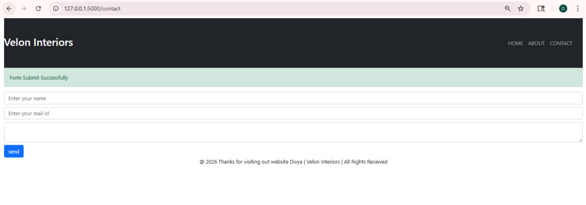

Flask Contact Form App

📌 Project Description

This is a multi-page web application built using Python and Flask. The project demonstrates template inheritance using Jinja2, form handling with GET and POST methods, and storing user-submitted data into a file.

The application includes a contact form where users can submit their details, and the data is processed and stored on the backend.

---

🚀 Features

- Multi-page routing (Home, About, Contact)
- Template inheritance using Jinja2 (base, navbar, footer)
- Dynamic data rendering using "{{ }}"
- Form handling using POST method
- Display success message after form submission
- Store user input data into a text file ("data.txt")
- Bootstrap-based basic UI design

---

🧠 How It Works

1. User enters details in the contact form
2. Form sends data to Flask backend using POST request
3. Flask processes the data using "request.form"
4. Data is saved into "data.txt" file
5. A success message is displayed on the UI

---

🛠️ Technologies Used

- Python
- Flask
- HTML
- Bootstrap
- Jinja2

---

📂 Project Structure

project/
│
├── app.py
├── data.txt
│
├── static/
│   ├── stylesheet.css
│   └── skills.png
│
├── templates/
│   ├── base.html
│   ├── navbar.html
│   ├── footer.html
│   ├── home.html
│   ├── about.html
│   └── contact.html
│
└── assets/
    └── screenshot.png

---

▶️ How to Run the Project

1. Clone the repository:

git clone https://github.com/your-username/flask-contact-form-app.git

2. Navigate to project folder:

cd flask-contact-form-app

3. Install Flask:

pip install flask

4. Run the application:

python app.py

5. Open browser:

http://127.0.0.1:5000/

---

📸 Output Screenshot

📌 Future Improvements

- Store data in database (MySQL)
- Add form validation
- Improve UI design
- Add user authentication

---

👩‍💻 Author

Divya
